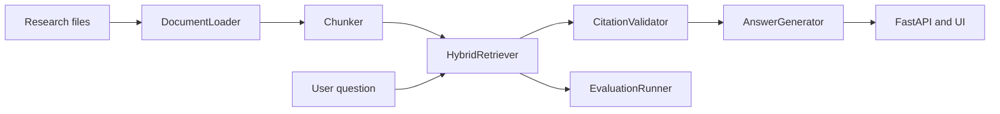

# ScholarTrace

A transparent, evidence-first research assistant for academic retrieval and grounded question answering.

Live demo: https://scholartrace-x7xu.onrender.com

ScholarTrace is a full-stack Retrieval-Augmented Generation system designed to make the retrieval layer visible, auditable, and reproducible. The project does not hide evidence behind opaque model behavior. Instead, it retrieves source passages, scores them, ranks them, and grounds every answer in traceable citations from the indexed corpus.

The application is built for research clarity as much as for user experience. It supports real academic corpora, user-uploaded documents, and systematic evaluation workflows for retrieval quality and citation coverage.

## Why this project matters

Most RAG demos stop at a single model invocation. ScholarTrace goes further:

- it validates source documents before indexing,
- it preserves passage metadata such as title, section, page, and source URL,
- it exposes retrieval scores and evidence quality signals,
- it reranks results to reduce duplicate evidence from the same source,
- it grounds every answer in source passages that can be inspected,
- and it measures retrieval quality with reproducible evaluation metrics.

This makes the project useful both as a working application and as a research artifact for studying retrieval behavior and citation quality.

## Core capabilities

- Hybrid retrieval using TF-IDF, BM25, and overlap-based signals
- Metadata-aware search across document titles and section names
- Diversity-aware reranking across source documents
- Configurable chunk size and overlap settings
- Support for JSON, Markdown, TXT, and optional PDF ingestion
- Extractive answer generation with citation-grounded evidence
- Explicit abstention when the corpus does not contain enough evidence
- Query latency and retrieval counts in every API response
- Benchmarking with Recall@K, MRR, Precision@K, and citation coverage metrics
- FastAPI backend with OpenAPI documentation
- Responsive web interface for live use and demonstrations

## System architecture



### Runtime flow

1. DocumentLoader reads structured records or converts user files into records.
2. Chunker creates passage-level units while preserving document metadata.
3. HybridRetriever builds a searchable index using multiple retrieval signals.
4. A diversity reranker helps avoid concentration of evidence from a single document.
5. CitationValidator filters unsupported or weakly matched passages.
6. DemoAnswerGenerator selects the best supporting evidence for the final answer.
7. ResearchPipeline measures latency and coordinates retrieval and answering.
8. The FastAPI service exposes the result to the browser and API clients.

## Live demo

- Web app: https://scholartrace-x7xu.onrender.com
- API docs: http://127.0.0.1:8000/docs when running locally

## Quick start

### Local development

```powershell
.venv\Scripts\Activate.ps1
uvicorn scholartrace.api:app --reload
```

Then open:

```text
http://127.0.0.1:8000
```

### New environment setup

```powershell
py -m venv .venv
.venv\Scripts\Activate.ps1
pip install -e ".[dev]"
```

Optional PDF support:

```powershell
pip install -e ".[dev,pdf]"
```

## Example usage

Try questions such as:

```text
How should a RAG system be evaluated?
```

```text
Why do machine learning systems need observability?
```

```text
What are data contracts?
```

The interface displays the grounded answer, confidence estimate, supporting evidence, source metadata, retrieval count, and measured latency.

## Data strategy

ScholarTrace supports several corpus modes, each intentionally designed for a different research or operational use case:

- `data/arxiv_corpus.json`: the primary research corpus collected from arXiv and used by default in normal application mode.
- `data/sample_corpus.json`: a smaller demo corpus retained for smoke tests and lightweight debugging.
- `data/uploads/`: user-uploaded documents indexed at runtime.

The app and evaluation scripts prefer real scholarly data. The demo dataset is not the default production path.

## Data ingestion

The loader supports:

- JSON records with ScholarTrace metadata
- Markdown notes
- Plain text files
- PDF files when optional dependencies are installed

Each record can include the following fields:

```json
{
  "id": "paper-001",
  "title": "Example Research Paper",
  "section": "Methods",
  "page": 3,
  "text": "The research passage goes here.",
  "source_url": "https://example.org/paper"
}
```

For PDFs, the loader creates one source record per page so citations retain page provenance. Local Markdown and TXT files receive a `file://` source reference.

## API usage

Health check:

```http
GET /api/health
```

Example PowerShell request:

```powershell
Invoke-RestMethod `
  -Uri http://127.0.0.1:8000/api/query `
  -Method Post `
  -ContentType "application/json" `
  -Body '{"question":"How should a RAG system be evaluated?","top_k":3}'
```

The response includes:

- `answer`: the extractive answer text with citation numbers
- `confidence`: a retrieval-based confidence estimate
- `abstained`: whether the system declined to answer
- `citations`: selected evidence for the answer
- `retrieval`: all ranked results returned for the query
- `latency_ms`: measured local pipeline latency
- `retrieval_count`: number of retrieved passages

Upload a document through the API:

```powershell
curl.exe -X POST http://127.0.0.1:8000/api/documents -F "file=@research-notes.md"
```

## Reproducible experiments

The repository includes an arXiv abstract corpus in `data/arxiv_corpus.json` when generated locally. For a much larger corpus, run:

```powershell
python scripts\collect_arxiv.py --limit 1000
python scripts\build_arxiv_cases.py
python scripts\run_experiments.py
```

The experiment compares three configurations:

1. TF-IDF cosine similarity only
2. BM25 only
3. The ScholarTrace hybrid configuration

Results are written to `experiments/retrieval_ablation.json` and interpreted in `experiments/REPORT.md`.

## Human-authored evaluation data

ScholarTrace includes an importer for the HotpotQA distractor development set. HotpotQA contains human-written questions, answers, context paragraphs, and gold supporting facts, and it is distributed under the CC BY-SA 4.0 license.

Run:

```powershell
python scripts\collect_hotpotqa.py --limit 100
python scripts\run_experiments.py
```

The importer preserves the original question and answer fields and maps gold supporting-fact titles to ScholarTrace document IDs. Some environments block the official dataset host; in those cases the importer fails safely instead of creating misleading local data.

## Evaluation methodology

The retrieval benchmark uses a configurable value of K, defaulting to 3.

- **Recall@K:** proportion of questions with at least one relevant result in the top K
- **Mean Reciprocal Rank:** average reciprocal position of the first relevant result
- **Precision@K:** proportion of returned results that are relevant
- **Citation coverage:** proportion of returned results that correspond to labeled relevant evidence

These metrics evaluate retrieval and evidence selection, not factual correctness by themselves. A stronger study should add human judgments for faithfulness, citation correctness, completeness, and unsupported claims.

## Current results

The checked-in arXiv experiment currently reports:

| Retriever | Recall@3 | MRR | Precision@3 | Citation coverage |
| --- | ---: | ---: | ---: | ---: |
| TF-IDF | 1.000 | 1.000 | 0.800 | 0.800 |
| BM25 | 1.000 | 1.000 | 0.333 | 0.333 |
| Hybrid | 1.000 | 1.000 | 0.800 | 0.800 |

These results are useful as a baseline, but they should not be overstated. The arXiv cases are silver labels derived from paper metadata, and perfect recall on this benchmark does not mean the system solves general academic question answering.

## Repository structure

```text
scholartrace/
├── .github/workflows/ci.yml
├── data/
│   ├── arxiv_corpus.json
│   ├── arxiv_evaluation_cases.json
│   ├── evaluation_cases.json
│   ├── sample_corpus.json
│   └── uploads/
├── experiments/
│   ├── README.md
│   ├── REPORT.md
│   └── retrieval_ablation.json
├── frontend/
│   ├── app.js
│   ├── index.html
│   └── styles.css
├── scripts/
│   ├── build_arxiv_cases.py
│   ├── collect_arxiv.py
│   ├── collect_hotpotqa.py
│   ├── evaluate.py
│   └── run_experiments.py
├── src/
│   └── scholartrace/
├── tests/
│   ├── test_api.py
│   └── test_pipeline.py
├── Dockerfile
├── README.md
├── pyproject.toml
├── render.yaml
└── .gitignore
```

## Deployment

The repository includes a Render configuration in `render.yaml` for a free deployment target.

```yaml
services:
  - type: web
    name: scholartrace
    runtime: python
    plan: free
    buildCommand: pip install .
    startCommand: uvicorn scholartrace.api:app --host 0.0.0.0 --port $PORT
    healthCheckPath: /api/health
```

Render uses the health check at `/api/health`. The app starts with `uvicorn` on Render’s `$PORT` value. This is suitable for a public demonstration, but free instances may sleep when inactive, and uploads are not durable on ephemeral storage.

## License and research use

This project is designed for transparent research use and reproducible evaluation. If you publish results derived from the included datasets or experimental workflows, retain attribution to the source data and document corpus version, collection date, query parameters, and evaluation configuration.

## Contributing

Contributions are welcome in the form of documentation improvements, dataset extensions, retrieval experiments, evaluation refinements, or UI polish. The project is intentionally structured to make experimentation easy without rewriting the underlying application.
│   ├── sample_corpus.json
│   ├── arxiv_corpus.json
│   ├── arxiv_evaluation_cases.json
│   └── evaluation_cases.json
├── experiments/
│   ├── README.md
│   ├── REPORT.md
│   └── retrieval_ablation.json
├── frontend/
│   ├── index.html
│   ├── app.js
│   └── styles.css
├── scripts/
│   ├── collect_arxiv.py
│   ├── collect_hotpotqa.py
│   ├── build_arxiv_cases.py
│   ├── run_experiments.py
│   └── evaluate.py
├── src/scholartrace/
│   ├── api.py
│   ├── evaluation.py
│   ├── generation.py
│   ├── ingestion.py
│   ├── models.py
│   ├── pipeline.py
│   └── retrieval.py
├── tests/
├── Dockerfile
├── README.md
└── pyproject.toml
```

## Development Checks

Run the complete local verification workflow:

```powershell
pytest -q
python scripts\evaluate.py
python scripts\run_experiments.py
```

The project includes regression tests for:

- Relevant evidence ranking.
- Empty and unsupported questions.
- Directory ingestion.
- Configurable chunking.
- Evaluation metric bounds.
- API health responses.
- API citations and telemetry.

GitHub Actions runs the test suite on pushes and pull requests.

## Free Deployment with Render

The repository includes `render.yaml` for a free Render web service. To deploy it:

1. Sign in at [render.com](https://render.com) with GitHub.
2. Choose **New**, then **Blueprint**.
3. Select `TejvirG/ScholarTrace`.
4. Confirm the service from `render.yaml` and choose the free plan.
5. Wait for the build to finish, then open the generated `.onrender.com` URL.

Render uses the health check at `/api/health`. The service starts with `uvicorn` on Render's `$PORT` value. This is suitable for a public demonstration, but free instances can sleep when inactive and local uploads are not durable. Do not upload private or sensitive documents to a public demo.

## Engineering Decisions

### A Deterministic Baseline Comes First

The local generator is intentionally extractive. It makes the evidence path visible and provides a stable baseline for later language-model comparisons.

### Evidence Is Separate from Generation

Retrieval is a distinct component rather than an invisible step inside a prompt. This makes ranking errors measurable and allows different retrievers to be compared fairly.

### Abstention Is a Feature

When the corpus does not contain enough evidence, the system says so instead of producing an unsupported answer.

### Provenance Travels with the Data

Document ID, title, section, page, and source URL are retained from ingestion through retrieval and API serialization.

### Experiments Are Part of the Product

The experiment scripts, input cases, output JSON, and written interpretation are checked into the repository so results can be reviewed and reproduced.

## Limitations

- The default retriever is lexical and does not capture all semantic relationships.
- The demo generator is not a general-purpose language model.
- PDF extraction quality depends on document layout and parser support.
- Silver-label evaluation can overestimate performance.
- The default corpus is a research demonstration, not a complete academic library.
- Production use would require authentication, rate limiting, access control, privacy review, prompt-injection defenses, and structured monitoring.

## Recommended Research Extensions

1. Add dense embeddings and compare them with the lexical baseline.
2. Add a cross-encoder reranker and measure the latency versus quality tradeoff.
3. Build a held-out set of 50 to 100 human-written questions.
4. Have two reviewers score citation correctness and answer faithfulness.
5. Measure confidence calibration and abstention quality.
6. Add claim extraction and entailment checks.
7. Track experiments with MLflow or a versioned JSONL run log.
8. Evaluate robustness to paraphrases, long questions, and adversarial instructions.

## Attribution

The HotpotQA importer follows the public dataset format described by the HotpotQA project. HotpotQA is distributed under the CC BY-SA 4.0 license. The arXiv collector stores metadata and abstracts from the public arXiv API and preserves source URLs for attribution.

## License

This repository is a personal research and portfolio project. Review the license terms of every external dataset before redistributing downloaded data or publishing derived artifacts.
