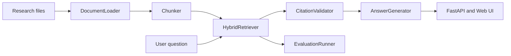

# ScholarTrace

> An evidence-grounded research assistant that retrieves, explains, and evaluates answers from academic sources.

ScholarTrace is a complete Retrieval-Augmented Generation project built to show how an AI system works beyond a single notebook or model call. It accepts research documents, turns them into searchable passages, ranks evidence for a question, produces an answer with citations, and reports how well the retrieval system performed.

The project is designed for clarity and reproducibility. The default answer generator is deterministic and runs locally without an API key. This makes it possible to inspect the retrieval pipeline, reproduce the experiments, and understand system failures before adding a hosted language model.

## Why This Project Matters

Many RAG demos stop after importing a library and asking a model to answer a question. ScholarTrace treats RAG as a software and research system with separate responsibilities:

- Documents are validated before they enter the index.
- Chunks preserve title, section, page, and source URL metadata.
- Retrieval exposes interpretable component scores.
- Results are reranked to reduce duplicate evidence from one document.
- Answers point back to numbered source passages.
- Unsupported questions receive an explicit abstention response.
- Experiments compare retrieval strategies using repeatable metrics.
- Tests cover ingestion, retrieval, abstention, evaluation, and the API.

This makes the repository useful as both a working application and a foundation for a research study.

## Features

- Hybrid retrieval using TF-IDF cosine similarity, BM25, and token overlap.
- Metadata-aware search using document titles and section names.
- Diversity-aware reranking across source documents.
- Configurable chunk size and word overlap.
- JSON, Markdown, TXT, and optional PDF ingestion.
- Sentence-level extractive answers with citation numbers.
- Abstention when the corpus does not contain adequate evidence.
- Query latency and retrieval count in every API response.
- Recall@K, MRR, precision@K, and citation coverage metrics.
- Retrieval ablation experiments comparing TF-IDF, BM25, and hybrid scoring.
- FastAPI backend with automatic OpenAPI documentation.
- Responsive browser interface for live demonstrations.
- Dockerfile and GitHub Actions test workflow.
- Local Git history with focused implementation commits.

## System Architecture



### Runtime Flow

1. `DocumentLoader` reads structured records or converts local files into records.
2. `Chunker` creates stable passages while preserving source metadata.
3. `HybridRetriever` builds an in-memory index with TF-IDF, BM25, and overlap signals.
4. A diversity reranker prevents the top results from being dominated by one document.
5. `CitationValidator` filters out passages that do not share meaningful terms with the question.
6. `DemoAnswerGenerator` selects the best matching sentence from each supported passage.
7. `ResearchPipeline` combines these components and measures query latency.
8. The FastAPI service exposes the result to the browser and external clients.

The code keeps these responsibilities separate so future experiments can replace one component without rewriting the entire application.

## Quick Start

The project has already been configured with a Python virtual environment. From PowerShell, run:

```powershell
.venv\Scripts\Activate.ps1
uvicorn scholartrace.api:app --reload
```

Open the application at:

```text
http://127.0.0.1:8000
```

The interactive API documentation is available at:

```text
http://127.0.0.1:8000/docs
```

For a new machine, create the environment and install the package with:

```powershell
py -m venv .venv
.venv\Scripts\Activate.ps1
pip install -e ".[dev]"
```

PDF ingestion is optional because it adds an external parser dependency:

```powershell
pip install -e ".[dev,pdf]"
```

## Using the Application

Try questions such as:

```text
How should a RAG system be evaluated?
```

```text
Why do machine learning systems need observability?
```

```text
What are data contracts?
```

The interface displays the grounded answer, confidence estimate, supporting passages, source metadata, retrieval count, and local retrieval latency.

## API Usage

Health check:

```http
GET /api/health
```

Example PowerShell request:

```powershell
Invoke-RestMethod `
  -Uri http://127.0.0.1:8000/api/query `
  -Method Post `
  -ContentType "application/json" `
  -Body '{"question":"How should a RAG system be evaluated?","top_k":3}'
```

The query response includes:

- `answer`: the extractive answer text with citation numbers.
- `confidence`: a retrieval-based confidence estimate.
- `abstained`: whether the system declined to answer.
- `citations`: evidence selected for the answer.
- `retrieval`: all ranked results returned for the query.
- `latency_ms`: measured local pipeline latency.
- `retrieval_count`: number of ranked passages.

Each retrieved passage includes its title, section, page, source URL, combined score, TF-IDF score, overlap score, and BM25 score.

## Data Ingestion

The loader accepts the following formats:

- JSON files containing ScholarTrace records.
- Markdown notes.
- Plain text files.
- PDF files when the optional `pypdf` dependency is installed.

Structured records use this shape:

```json
{
  "id": "paper-001",
  "title": "Example Research Paper",
  "section": "Methods",
  "page": 3,
  "text": "The research passage goes here.",
  "source_url": "https://example.org/paper"
}
```

For PDFs, the loader creates one source record per page so citations retain page provenance. Local Markdown and TXT files receive a `file://` source reference.

## Reproducible Experiments

The repository includes a 50-paper arXiv abstract snapshot in `data/arxiv_corpus.json`. Recreate the snapshot and its silver-label cases with:

```powershell
python scripts\collect_arxiv.py --limit 50
python scripts\build_arxiv_cases.py
python scripts\run_experiments.py
```

The experiment compares three configurations:

1. TF-IDF cosine similarity only.
2. BM25 only.
3. The ScholarTrace hybrid configuration.

Results are written to `experiments/retrieval_ablation.json` and interpreted in `experiments/REPORT.md`.

## Human-Authored Evaluation Data

ScholarTrace includes an importer for the HotpotQA distractor development set. HotpotQA contains human-written questions, answers, context paragraphs, and gold supporting facts. The dataset is distributed under the CC BY-SA 4.0 license.

Run:

```powershell
python scripts\collect_hotpotqa.py --limit 100
python scripts\run_experiments.py
```

The importer preserves the original question and answer fields and maps gold supporting-fact titles to ScholarTrace document IDs. Some network environments block the official dataset host. In that situation, the importer fails without creating misleading local data. The project never presents automatically generated questions as human-authored questions.

## Evaluation Methodology

The retrieval benchmark uses a configurable value of K, with K set to 3 by default.

- **Recall@K:** the proportion of questions with at least one relevant result in the top K.
- **Mean Reciprocal Rank:** the average reciprocal position of the first relevant result.
- **Precision@K:** the proportion of returned results that are relevant.
- **Citation coverage:** the proportion of returned results that correspond to labeled relevant evidence.

These metrics evaluate retrieval and evidence selection. They do not prove that a generated answer is factually correct. A stronger study should add human judgments for answer faithfulness, citation correctness, completeness, and unsupported claims.

## Current Results

The checked-in arXiv experiment currently reports:

| Retriever | Recall@3 | MRR | Precision@3 | Citation coverage |
| --- | ---: | ---: | ---: | ---: |
| TF-IDF | 1.000 | 1.000 | 0.800 | 0.800 |
| BM25 | 1.000 | 1.000 | 0.333 | 0.333 |
| Hybrid | 1.000 | 1.000 | 0.800 | 0.800 |

These results are useful as a baseline, but they should not be overstated. The arXiv cases are generated from paper titles and therefore are silver labels. Perfect recall on this task does not mean the system solves general academic question answering.

## Repository Structure

```text
scholartrace/
├── .github/workflows/ci.yml
├── data/
│   ├── sample_corpus.json
│   ├── arxiv_corpus.json
│   ├── arxiv_evaluation_cases.json
│   └── evaluation_cases.json
├── experiments/
│   ├── README.md
│   ├── REPORT.md
│   └── retrieval_ablation.json
├── frontend/
│   ├── index.html
│   ├── app.js
│   └── styles.css
├── scripts/
│   ├── collect_arxiv.py
│   ├── collect_hotpotqa.py
│   ├── build_arxiv_cases.py
│   ├── run_experiments.py
│   └── evaluate.py
├── src/scholartrace/
│   ├── api.py
│   ├── evaluation.py
│   ├── generation.py
│   ├── ingestion.py
│   ├── models.py
│   ├── pipeline.py
│   └── retrieval.py
├── tests/
├── Dockerfile
├── README.md
└── pyproject.toml
```

## Development Checks

Run the complete local verification workflow:

```powershell
pytest -q
python scripts\evaluate.py
python scripts\run_experiments.py
```

The project includes regression tests for:

- Relevant evidence ranking.
- Empty and unsupported questions.
- Directory ingestion.
- Configurable chunking.
- Evaluation metric bounds.
- API health responses.
- API citations and telemetry.

GitHub Actions runs the test suite on pushes and pull requests.

## Engineering Decisions

### A Deterministic Baseline Comes First

The local generator is intentionally extractive. It makes the evidence path visible and provides a stable baseline for later language-model comparisons.

### Evidence Is Separate from Generation

Retrieval is a distinct component rather than an invisible step inside a prompt. This makes ranking errors measurable and allows different retrievers to be compared fairly.

### Abstention Is a Feature

When the corpus does not contain enough evidence, the system says so instead of producing an unsupported answer.

### Provenance Travels with the Data

Document ID, title, section, page, and source URL are retained from ingestion through retrieval and API serialization.

### Experiments Are Part of the Product

The experiment scripts, input cases, output JSON, and written interpretation are checked into the repository so results can be reviewed and reproduced.

## Limitations

- The default retriever is lexical and does not capture all semantic relationships.
- The demo generator is not a general-purpose language model.
- PDF extraction quality depends on document layout and parser support.
- Silver-label evaluation can overestimate performance.
- The default corpus is a research demonstration, not a complete academic library.
- Production use would require authentication, rate limiting, access control, privacy review, prompt-injection defenses, and structured monitoring.

## Recommended Research Extensions

1. Add dense embeddings and compare them with the lexical baseline.
2. Add a cross-encoder reranker and measure the latency versus quality tradeoff.
3. Build a held-out set of 50 to 100 human-written questions.
4. Have two reviewers score citation correctness and answer faithfulness.
5. Measure confidence calibration and abstention quality.
6. Add claim extraction and entailment checks.
7. Track experiments with MLflow or a versioned JSONL run log.
8. Evaluate robustness to paraphrases, long questions, and adversarial instructions.

## Attribution

The HotpotQA importer follows the public dataset format described by the HotpotQA project. HotpotQA is distributed under the CC BY-SA 4.0 license. The arXiv collector stores metadata and abstracts from the public arXiv API and preserves source URLs for attribution.

## License

This repository is a personal research and portfolio project. Review the license terms of every external dataset before redistributing downloaded data or publishing derived artifacts.
