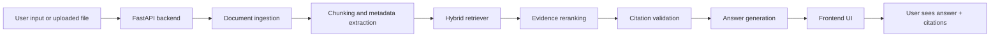
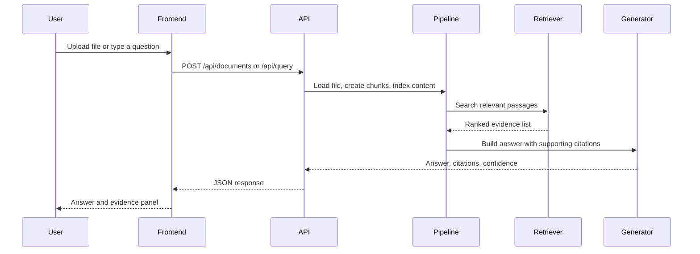

# ScholarTrace

ScholarTrace is a local, evidence-first retrieval-augmented generation (RAG) application for research and document-grounded question answering. It is built to help a user ask questions against a corpus or against a file they upload, and then inspect the actual evidence used to answer the question.

This project is not just a chatbot demo. It is intended to show a real RAG workflow in a simple and transparent way:

- the system finds relevant passages
- ranks them using multiple signals
- checks whether the evidence is strong enough
- answers with citations
- keeps the answer traceable and inspectable

This makes it useful for research workflows, document analysis, academic reading, and local knowledge extraction where source grounding matters.

## Why this project exists

In many AI applications, the model can answer convincingly without actually showing where the answer came from. That creates trust problems. For research, academic work, documentation, and technical review, this is not enough.

A strong RAG system should do the following:

- find the right evidence first
- use only retrieved context to answer
- show the evidence behind the answer
- avoid answering when the corpus is weak or missing
- allow users to inspect the source passages

ScholarTrace was designed around these principles. It gives you a local, understandable RAG system that can be used to explore documents, upload research files, and ask grounded questions without hiding the retrieval process.

## Benefits of this project

- Transparent retrieval: you can see the exact passages used
- Evidence-based answers: the model is grounded in retrieved content
- Works with uploaded files: users can ask questions about their own document
- Flexible background pipeline: supports local corpus data, uploaded documents, and research JSON
- Good for learning RAG architecture: each step is cleanly separated
- Good for demos and prototypes: easy to run locally in a browser
- Good for technical evaluation: includes benchmark-style retrieval scoring

## What the system does

ScholarTrace lets a user do one of the following:

1. Ask a question against the active research corpus
2. Upload a document and ask questions about that file
3. Search without typing a prompt if the uploaded file is the only evidence source
4. Inspect supporting passages and citations returned by the system
5. Review evaluation metrics such as recall and retrieval quality

The app is built to behave like a research assistant that works with evidence, not guesswork.

## High-level architecture



## End-to-end pipeline



## How the project works in simple language

The system follows a standard and practical RAG pattern:

1. A document is loaded
2. It is split into smaller chunks
3. Important metadata is preserved
4. A search step reads the question and finds relevant chunks
5. Those chunks are ranked by lexical and retrieval signals
6. A generator chooses the most relevant evidence and forms the answer
7. Citations are attached so the user can inspect the source text

This clears the gap between model output and human verification. The answer is not just a generated sentence; it is a grounded answer grounded in actual text.

## Main functionality

### 1. Corpus ingestion

The project can load documents from several sources:

- local JSON research records
- Markdown files
- plain text files
- PDF files when optional PDF support is installed
- uploaded user documents in the local web app

The ingestion layer reads the content and converts it into chunked text blocks for retrieval.

### 2. Chunking and metadata preservation

Each document is split into chunk units. Metadata such as:

- document ID
- title
- section
- page
- source URL
- authors
- year
- DOI

is preserved alongside the chunk text. This is important because evidence needs to be traceable and explainable.

### 3. Hybrid retrieval

The retriever combines multiple signals:

- lexical similarity
- BM25 scoring
- overlap scoring
- semantic similarity fallback
- diversity-aware reranking

This makes retrieval stronger than a single scoring method. The system is designed to surface relevant evidence even when the question is imperfect or phrased in a different way.

### 4. Answer generation with evidence

The generator uses the top retrieved passages to produce an answer. It also checks whether the result is strongly supported. If support is weak, the system can abstain rather than hallucinate.

This is a key ethical and technical feature in RAG: the model is encouraged to say when it does not have enough evidence.

### 5. Uploaded-file search

The project supports a very important workflow: a user can upload a file and ask questions about it without writing a long prompt first.

The app can also behave in a file-first mode where the uploaded file acts as the active evidence source. This is useful when the user wants a local research summary based on a single document or a small corpus.

### 6. Evaluation

ScholarTrace includes a benchmark layer for retrieval quality. This lets you run queries against evaluation cases and inspect metrics such as:

- Recall@5
- Recall@10
- reciprocal rank
- precision
- citation coverage

This is useful for comparing retrieval quality and understanding whether the system is finding the right passages.

## The need for this project

The need for this project is straightforward:

- generative AI often gives answers without evidence
- users cannot easily trust or verify claims
- research workflows need grounded reference passages
- document analysis should be inspectable and explainable
- local file-based knowledge workflows are often more practical than large cloud-only systems

This project addresses those needs by pairing retrieval with verification and source traceability.

## Architecture in modules

The code is organized into clear components:

- `api.py` — FastAPI app and endpoints
- `pipeline.py` — orchestration of ingestion, retrieval, and generation
- `retrieval.py` — hybrid retrieval logic
- `generation.py` — answer generation and evidence validation
- `ingestion.py` — document loading and chunk creation
- `evaluation.py` — benchmark runner and evaluation cases
- `models.py` — data structures for chunks, answers, and search results

## Project layout

```text
rag_project/
├── data/
│   ├── arxiv_corpus.json
│   ├── arxiv_evaluation_cases.json
│   ├── evaluation_cases.json
│   ├── sample_corpus.json
│   └── uploads/
├── experiments/
│   ├── README.md
│   ├── REPORT.md
│   └── retrieval_ablation.json
├── frontend/
│   ├── app.js
│   ├── index.html
│   └── styles.css
├── scripts/
│   ├── build_arxiv_cases.py
│   ├── collect_arxiv.py
│   ├── collect_hotpotqa.py
│   ├── evaluate.py
│   ├── ingest_arxiv_pdfs.py
│   └── run_experiments.py
├── src/
│   └── scholartrace/
│       ├── __init__.py
│       ├── api.py
│       ├── evaluation.py
│       ├── generation.py
│       ├── ingestion.py
│       ├── models.py
│       ├── pipeline.py
│       └── retrieval.py
├── tests/
│   ├── test_api.py
│   └── test_pipeline.py
├── Dockerfile
├── README.md
├── pyproject.toml
├── render.yaml
└── .venv/
```

## Local setup

### 1. Create the environment

```powershell
cd c:\Users\HP\Desktop\rag_project
py -m venv .venv
.venv\Scripts\Activate.ps1
pip install -e ".[dev]"
```

### 2. Optional PDF support

If you want PDF ingestion, install the extra dependency:

```powershell
pip install -e ".[dev,pdf]"
```

### 3. Start the app

```powershell
uvicorn scholartrace.api:app --reload
```

Then open the app in the browser:

```text
http://127.0.0.1:8000
```

## Usage examples

### Ask a question against the corpus

Type a question like:

```text
How should a RAG system be evaluated?
```

The app will:

- retrieve relevant chunks
- rank them using the hybrid retriever
- generate an answer from the evidence
- show citations and confidence

### Upload a file and ask about it

1. Click Upload file
2. Choose a local `.md`, `.txt`, `.json`, or `.pdf` document
3. Ask a question or leave it blank to search based on the uploaded file itself
4. Review the answer and citations produced from that document

This is useful for personal notes, research drafts, technical documents, and local project notes.

## API reference

### Health endpoint

```http
GET /api/health
```

Returns metadata about the active index, number of chunks, source type, and retrieval configuration.

### Query endpoint

```http
POST /api/query
```

Example request:

```json
{
  "question": "How should a RAG system be evaluated?",
  "top_k": 4
}
```

Example response:

```json
{
  "question": "How should a RAG system be evaluated?",
  "answer": "A RAG system should be evaluated on retrieval quality, answer grounding, and evidence coverage.",
  "confidence": 0.81,
  "abstained": false,
  "citations": [
    {
      "title": "Evidence retrieval",
      "section": "Document",
      "text": "Retrieval quality matters because it determines what evidence is available to the model.",
      "score": 0.42
    }
  ],
  "retrieval_count": 4,
  "latency_ms": 12.5
}
```

### Document upload endpoint

```http
POST /api/documents
```

Upload one supported file and index it into the local evidence set.

Supported formats:

- `.md`
- `.txt`
- `.json`
- `.pdf`

## Why this is a strong project for demonstration

This project is strong because it demonstrates the real core of RAG:

- retrieval is visible
- evidence is inspected
- answer quality depends on source quality
- not every response is accepted if the evidence is weak
- the system is built to be understandable by humans

It is a better teaching and prototype project than a black-box chatbot because it makes each part of the pipeline legible.

## Deployment options

The project includes deployment support for simple hosting and container deployment.

- `Dockerfile` for container-based deployment
- `render.yaml` for Render deployment
- Python packaging metadata in `pyproject.toml`

This makes it usable both locally and in a lightweight deployment environment.

## Evaluation and benchmarking

The project includes retrieval evaluation helpers and benchmark-style cases. It can measure:

- whether relevant documents appear in the top results
- how many relevant results appear within the top K
- the quality of ranking
- how much of the answer is covered by retrieved evidence

Evaluation is important because a model may sound confident even when its evidence is weak. This project exposes the retrieval quality instead of hiding it.

## Current status and caveats

This project is a working local RAG application rather than a research-paper-only prototype. It is designed to be useful in practice and to demonstrate how a document-grounded assistant can work in a real environment.

Important caveats:

- it is local-first and not designed for very large-scale enterprise indexing by default
- retrieval is optimized for a clean, explainable local setup rather than a massive distributed production platform
- for large corpora, the next step is moving from in-memory indexing to a persistent vector or hybrid search backend

## Future improvements

Possible next steps for this project include:

- persistent vector indexing for large corpora
- database-backed document storage
- multi-document collection management
- user session history
- stronger answer summarization and citations formatting
- better UI for file selection, corpus management, and search history
- stronger integration with research-paper datasets and benchmarks

## Verification

This project has automated tests for the API and retrieval pipeline. You can run the suite with:

```powershell
.venv\Scripts\python.exe -m pytest -q
```

The project is currently in a passing state in this environment.

## Summary

ScholarTrace is a practical, transparent, and academically grounded RAG project. It helps users understand what retrieval-augmented generation really does, how evidence is used, and why source grounding matters.

It is useful for:

- document analysis
- research workflows
- local knowledge retrieval
- educational RAG demonstrations
- technical prototyping

If you want to understand the mechanics of RAG in a simple and inspectable way, this project is a good example.
│   ├── README.md
│   ├── REPORT.md
│   └── retrieval_ablation.json
├── frontend/
│   ├── app.js
│   ├── index.html
│   └── styles.css
├── scripts/
│   ├── build_arxiv_cases.py
│   ├── collect_arxiv.py
│   ├── collect_hotpotqa.py
│   ├── evaluate.py
│   └── run_experiments.py
├── src/
│   └── scholartrace/
├── tests/
│   ├── test_api.py
│   └── test_pipeline.py
├── Dockerfile
├── README.md
├── pyproject.toml
├── render.yaml
└── .gitignore
```

## Deployment

The repository includes a Render configuration in `render.yaml` for a free deployment target.

```yaml
services:
  - type: web
    name: scholartrace
    runtime: python
    plan: free
    buildCommand: pip install .
    startCommand: uvicorn scholartrace.api:app --host 0.0.0.0 --port $PORT
    healthCheckPath: /api/health
```

Render uses the health check at `/api/health`. The app starts with `uvicorn` on Render’s `$PORT` value. This is suitable for a public demonstration, but free instances may sleep when inactive, and uploads are not durable on ephemeral storage.

## License and research use

This project is designed for transparent research use and reproducible evaluation. If you publish results derived from the included datasets or experimental workflows, retain attribution to the source data and document corpus version, collection date, query parameters, and evaluation configuration.

## Contributing

Contributions are welcome in the form of documentation improvements, dataset extensions, retrieval experiments, evaluation refinements, or UI polish. The project is intentionally structured to make experimentation easy without rewriting the underlying application.
│   ├── sample_corpus.json
│   ├── arxiv_corpus.json
│   ├── arxiv_evaluation_cases.json
│   └── evaluation_cases.json
├── experiments/
│   ├── README.md
│   ├── REPORT.md
│   └── retrieval_ablation.json
├── frontend/
│   ├── index.html
│   ├── app.js
│   └── styles.css
├── scripts/
│   ├── collect_arxiv.py
│   ├── collect_hotpotqa.py
│   ├── build_arxiv_cases.py
│   ├── run_experiments.py
│   └── evaluate.py
├── src/scholartrace/
│   ├── api.py
│   ├── evaluation.py
│   ├── generation.py
│   ├── ingestion.py
│   ├── models.py
│   ├── pipeline.py
│   └── retrieval.py
├── tests/
├── Dockerfile
├── README.md
└── pyproject.toml
```

## Development Checks

Run the complete local verification workflow:

```powershell
pytest -q
python scripts\evaluate.py
python scripts\run_experiments.py
```

The project includes regression tests for:

- Relevant evidence ranking.
- Empty and unsupported questions.
- Directory ingestion.
- Configurable chunking.
- Evaluation metric bounds.
- API health responses.
- API citations and telemetry.

GitHub Actions runs the test suite on pushes and pull requests.

## Free Deployment with Render

The repository includes `render.yaml` for a free Render web service. To deploy it:

1. Sign in at [render.com](https://render.com) with GitHub.
2. Choose **New**, then **Blueprint**.
3. Select `TejvirG/ScholarTrace`.
4. Confirm the service from `render.yaml` and choose the free plan.
5. Wait for the build to finish, then open the generated `.onrender.com` URL.

Render uses the health check at `/api/health`. The service starts with `uvicorn` on Render's `$PORT` value. This is suitable for a public demonstration, but free instances can sleep when inactive and local uploads are not durable. Do not upload private or sensitive documents to a public demo.

## Engineering Decisions

### A Deterministic Baseline Comes First

The local generator is intentionally extractive. It makes the evidence path visible and provides a stable baseline for later language-model comparisons.

### Evidence Is Separate from Generation

Retrieval is a distinct component rather than an invisible step inside a prompt. This makes ranking errors measurable and allows different retrievers to be compared fairly.

### Abstention Is a Feature

When the corpus does not contain enough evidence, the system says so instead of producing an unsupported answer.

### Provenance Travels with the Data

Document ID, title, section, page, and source URL are retained from ingestion through retrieval and API serialization.

### Experiments Are Part of the Product

The experiment scripts, input cases, output JSON, and written interpretation are checked into the repository so results can be reviewed and reproduced.

## Limitations

- The default retriever is lexical and does not capture all semantic relationships.
- The demo generator is not a general-purpose language model.
- PDF extraction quality depends on document layout and parser support.
- Silver-label evaluation can overestimate performance.
- The default corpus is a research demonstration, not a complete academic library.
- Production use would require authentication, rate limiting, access control, privacy review, prompt-injection defenses, and structured monitoring.

## Recommended Research Extensions

1. Add dense embeddings and compare them with the lexical baseline.
2. Add a cross-encoder reranker and measure the latency versus quality tradeoff.
3. Build a held-out set of 50 to 100 human-written questions.
4. Have two reviewers score citation correctness and answer faithfulness.
5. Measure confidence calibration and abstention quality.
6. Add claim extraction and entailment checks.
7. Track experiments with MLflow or a versioned JSONL run log.
8. Evaluate robustness to paraphrases, long questions, and adversarial instructions.

## Attribution

The HotpotQA importer follows the public dataset format described by the HotpotQA project. HotpotQA is distributed under the CC BY-SA 4.0 license. The arXiv collector stores metadata and abstracts from the public arXiv API and preserves source URLs for attribution.

## License

This repository is a personal research and portfolio project. Review the license terms of every external dataset before redistributing downloaded data or publishing derived artifacts.
